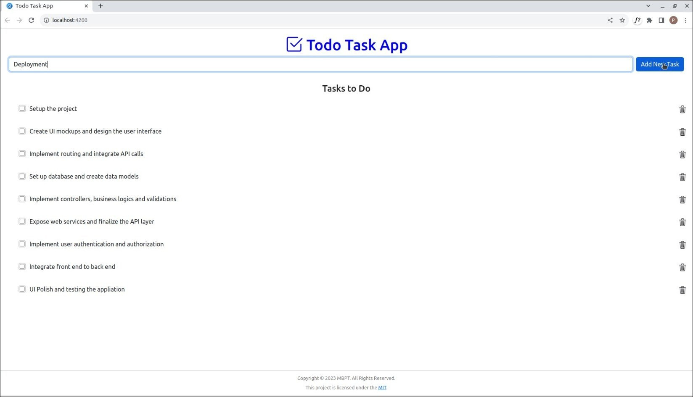
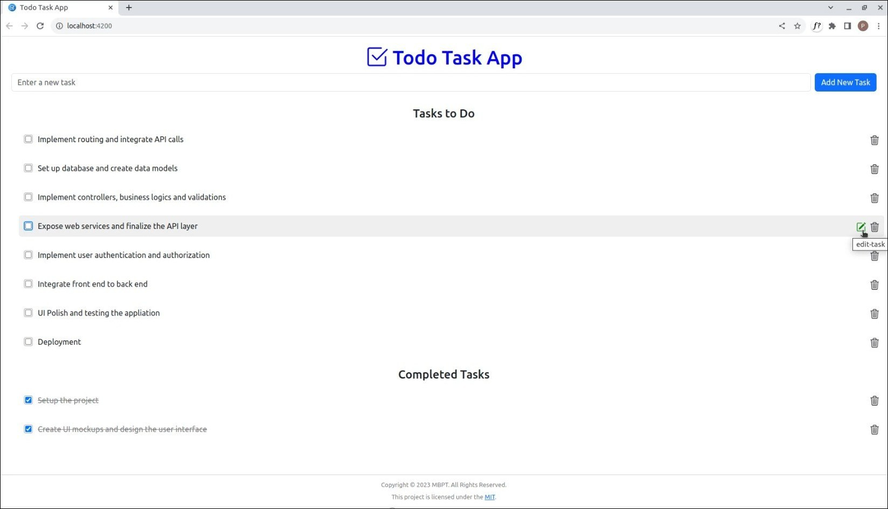

# Task Maestro Whizz Todo App

Task Maestro Whizz Todo App is a responsive web application designed to provide users with a user-friendly 
task management solution. It allows users to efficiently schedule, organize, and manage their tasks. 
Users can seamlessly create new tasks, modify existing tasks, remove completed or unnecessary tasks, 
mark tasks as completed and track their progress.

### Features
- **User-Friendly Interface:** An intuitive interface that makes task management easy for users of all levels.
- **Responsive Design:** The app is responsive and adapts to various devices and screen sizes, ensuring a seamless experience.
- **Effortless Task Tracking:** Users can mark tasks as completed, making it easy to track progress.
- **Clear Task Status:** Completed tasks are clearly identifiable, allowing users to distinguish between completed and pending tasks.
- **Organized Task List:** Users can remove completed or unnecessary tasks, keeping the task list organized.
- **Modify Tasks Seamlessly:** Modify existing tasks with ease to accommodate changes in plans or details.

### Technologies Used
- Back-end
  - Node.js
  - Promise MySQL
  - Express
  - CORS
- Front-end
  - Angular
  - Bootstrap
  - HTML
  - CSS
  - TypeScript

### Application Preview

## License

This project is licensed under the [MIT License](LICENSE).

